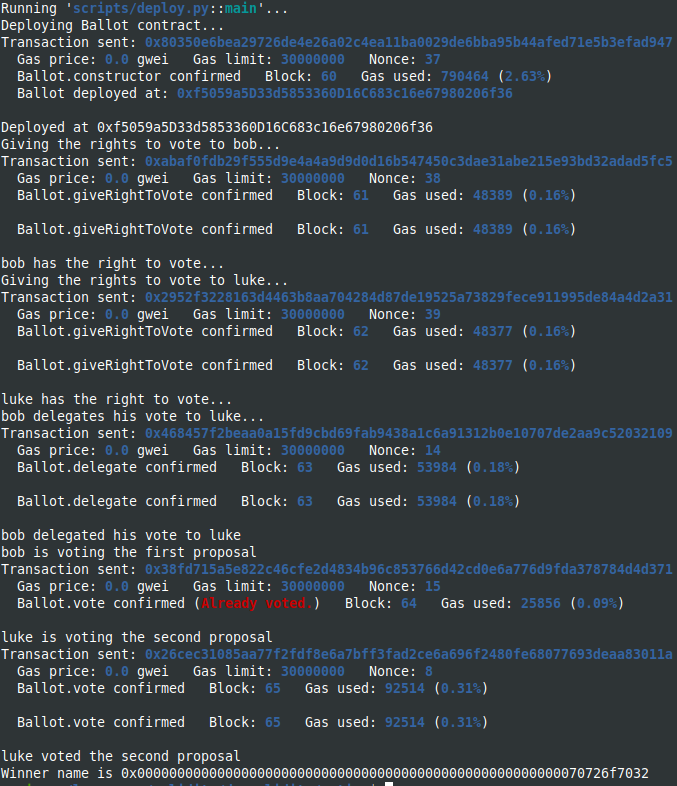
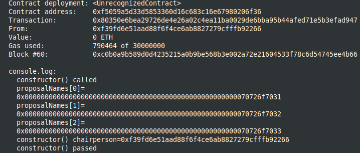

Study case of the Voting contract, from [Solidity documentation, voting](https://docs.soliditylang.org/en/latest/solidity-by-example.html#voting/)

I use brownie to compile and deploy into hardhat in order to have the console.log feature.
You should start the hardhat node in another terminal and folder (`hh node`), then, in a terminal :

```bash
brownie compile
brownie run scripts/deploy.py
```

After deploying from brownie :


The result in the hardhat console :


