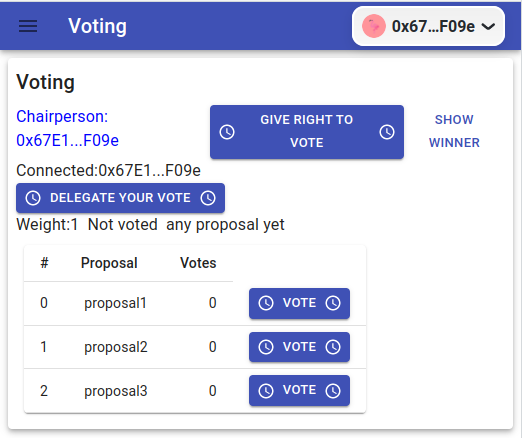

Study case of the Voting contract, from [Solidity documentation, voting](https://docs.soliditylang.org/en/latest/solidity-by-example.html#voting/)

## Frontend on the Rinkeby Testnet

The application is live on Netlify with the Ballot contract deployed on Rinkeby

https://votingfullstack.netlify.app/



- [Full-Stack Setup](#full-stack-setup)
  - [1. Git clone the contracts repo](#1-git-clone-the-contracts-repo)
  - [2. Start your node](#2-start-your-node)
  - [3. Configure .env file](#3-configure-env-file)
  - [4. Deploy on Hardhat](#4-deploy-on-hardhat)
  - [5. Configure .env file on the client](#5-configure-env-file-on-the-client)
  - [6. Start your front end](#6-start-your-front-end)

# Full-Stack Setup

## 1. Git clone the contracts repo

In it's own terminal / command line, run:

```
git clone https://github.com/trash89/voting
cd voting
npm install
cd ../client
npm install
cd ..
```

## 2. Start your node

After installing dependencies, start a node on it's own terminal with:

```
npx hardhat node
```

## 3. Configure env file

Enter your Rinkeby account private key and your Alchemy API key:

```.env
export PRIVATE_KEY=0xabcdef
export RINKEBY_RPC_URL ="https://eth-rinkeby.alchemyapi.io/v2/your-api-key"
UPDATE_FRONT_END=yes
```

## 4. Deploy on Hardhat

Prepare the network hh-local in brownie:

```
brownie networks add Ethereum hh-local host=http://127.0.0.1 chainid=31337
```

Then deploy :

```
brownie run scripts/brownie/deploy.py --network hh-local
```

## 5. Configure env file on the client

Enter your Alchemy API key:

```.env
GENERATE_SOURCEMAP=false
ALCHEMY_ID="abcdefgh"
```

## 6. Start your front end

At this point, you'll have one terminal running your Hardhat Node.

And you're about to have one more for your front end.

```
cd client
npm start
```

And you'll have your front end and blockchain running.
You can deploy again the contract on Rinkeby testnet and switch between two networks.
